# Старт: как у вас и что пробуем изменить

**Ты — в красном. Друг — с белыми волосами.** Разбор подготовлен 4 октября; дата занятия и замедление неизвестны.

На каждой карточке сначала ваш реальный кадр, затем пример целевого действия. **Условные схемы не изображают вашу следующую попытку и не задают обязательных углов.** Авторские видео открываются по ссылке. Во время одного повторения держите одну команду.

На странице GitHub Pages картинку можно нажать и открыть крупно. Короткие движения у стены скрыты под кнопкой «Посмотреть движение».

Быстрый переход: [Wall Hold](#wall-hold) · [March](#wall-march) · [Switch](#wall-switch) · [Falling](#falling) · [Твой низкий старт](#red-start) · [Старт друга](#white-start) · [Push-Up](#push-up).

## 1. Wall Hold — сохранить линию, меньше сжимать ногу

**Как у вас, красный:**

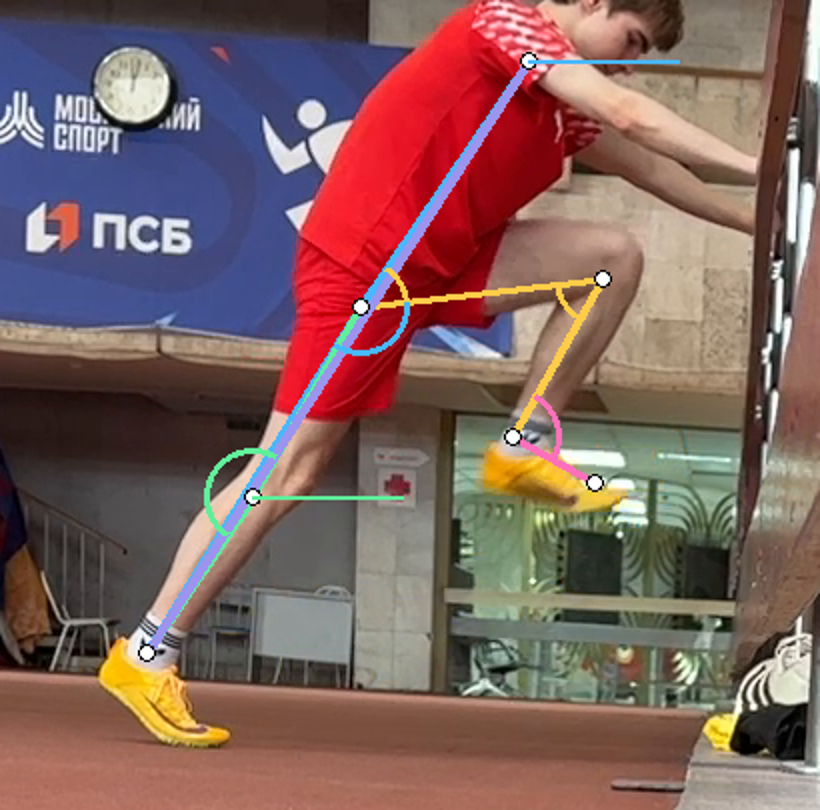

[Открыть кадр с подписями углов](assets/starts-2026-10-04/annotations/red-wall.png)

**Как у вас, друг:**

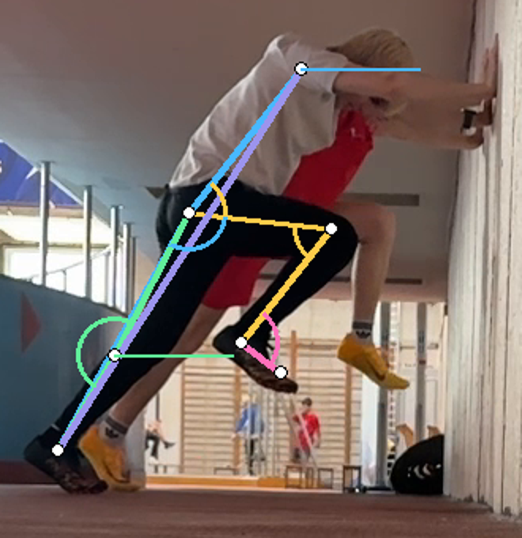

[Открыть кадр с подписями углов](assets/starts-2026-10-04/annotations/white-wall.png)

Плечо, таз и опорный голеностоп приблизительно на одной линии. Это сохраняем. Поднятая нога у обоих сильно приближена к животу: в выбранных проекциях колено согнуто примерно до 54–58°. Косой ракурс не позволяет считать эти числа точными пространственными углами.

**Что пробуем получить:**

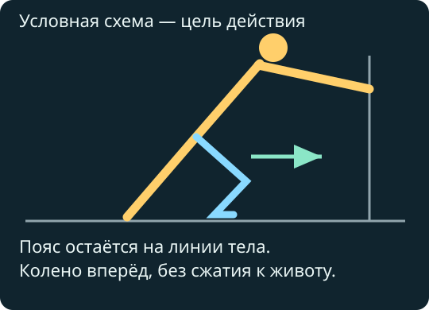

В выбранной модели Landow бедро направлено более вперёд относительно наклонного тела. Остановите подъём раньше, сохранив пояс и грудь. Не пытайтесь сильнее прижать колено к животу ради амплитуды.

**Команда обоим: «Колено вперёд, не к животу».**

**Проверка:** при подъёме ноги таз не опускается, пояс не меняет положение; затем такое исходное положение позволяет сменить ноги без перестановки всего тела. Проверяем на обеих сторонах.

[Схема и объяснение Landow](https://coachathletics.com.au/coaching-education/three-great-acceleration-drills-loren-landows-drill-progression) · [Его демонстрация с 1:16](https://www.youtube.com/watch?v=uwDEyE6phDc&t=76s). Это тренерская модель, не универсальная норма для бега.

## 2. Wall March — медленно найти повторяемую позу

**Как у вас:** поднял ногу → вернул обе стопы → следующий подъём. Для обучения медленным маршированием промежуточные две стопы допустимы.

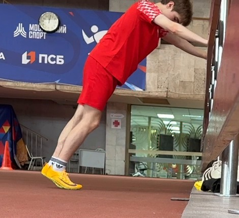

Посмотреть движение красного

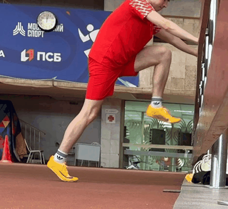

Посмотреть движение друга

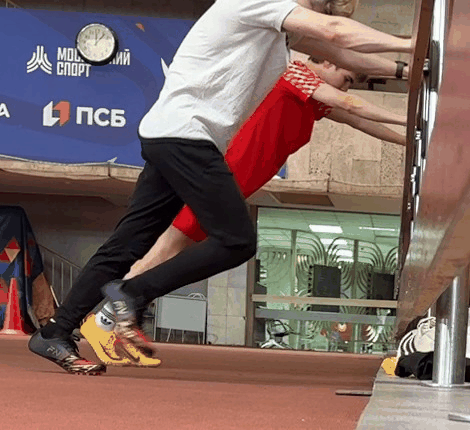

Анимации показывают выбранные кадры по времени файла. Они не подтверждают реальную скорость при неизвестном замедлении. В этих кропах голова частично обрезана.

**Что пробуем получить:**

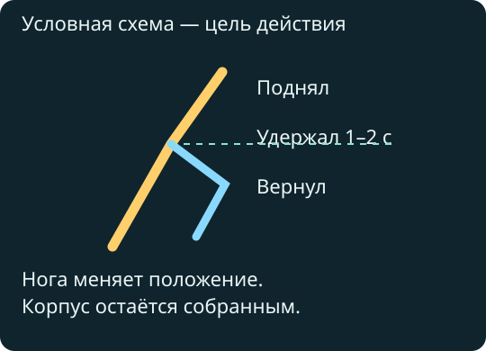

Та же команда про колено, что в Hold. Поднять, удержать 1–2 секунды, вернуть. Ощущение: двигается нога, грудь и пояс остаются собранными. Если приходится менять весь корпус, уменьшить подъём.

**Проверка:** три одинаковых подъёма каждой ногой без нарастающего качания. Не добавляем новые команды про пальцы и шею.

[Авторская демонстрация Wall March](https://www.youtube.com/watch?v=G1WvfCbg8uE). Сравнивайте удержание корпуса и последовательность, а не чужую высоту колена.

## 3. Single Switch — одна прямая смена, затем фиксация

**Как у вас в просмотренной серии:** между верхними положениями есть отдельная остановка на двух стопах. Это не та же задача, что быстрая одиночная смена.

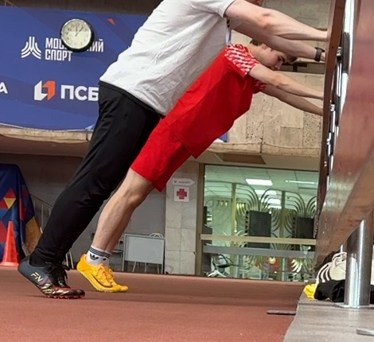

**Что пробуем получить:**

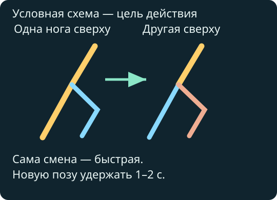

Начать с одной ногой наверху. Быстро поменять ноги и замереть в новом положении. Задача — убрать намеренную промежуточную остановку; не требуем по этим видео измеренного нулевого времени двойной опоры.

**Команда обоим: «Сменил — замри».** Ощущение: короткое переключение ног под собранным телом, затем спокойная фиксация. Подготовка следующего повтора может быть медленной.

**Проверка:** новый Hold получается без падения таза и без отдельного маршевого подъёма. Если нет — уменьшить число смен и вернуться к March. Хорошая смена ещё не доказывает улучшения старта.

[Landow: Wall-прогрессия](https://www.youtube.com/watch?v=uwDEyE6phDc&t=76s) · [Указатель урока Wall March / Switch](https://coachtube.com/course_lesson/drills-to-improve-sprint-performance/fast-five-wall-march-and-wall-switch/18411620). Платный урок отдельно не просмотрен.

## 4. Falling — у красного наклон сохраняется, не мешать этому

**Как у тебя: первая новая опора.**

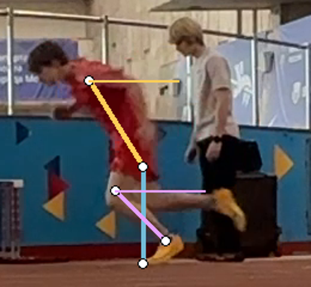

[Открыть кадр с подписями углов](assets/starts-2026-10-04/annotations/red-contact-1.png)

После выхода корпус остаётся наклонённым; первый шаг не выглядит специально вытянутым ради длины. Перед выходом есть сгибание коленей и организация опоры. Небольшое сгибание не запрещено.

**Что пробуем получить:**

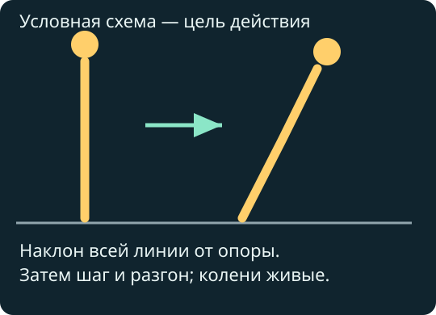

Если выполняете именно Falling, начать спокойнее из вертикальной стойки, позволить всему телу уйти вперёд от опоры и перейти в разгон без отдельного приседания.

**Команда для этого повтора: «Падай целиком и уходи вперёд».** Она заменяет стартовую команду, не становится четвёртым одновременным замечанием.

**Проверка:** на первых трёх опорах продолжается движение вперёд; не нужно удерживать голову вниз или специально удлинять шаг. У друга полноценная Falling-попытка пока не подтверждена — просмотренное объяснение с жестами не оценивается как спринт.

[Демонстрация Falling Start](https://www.youtube.com/watch?v=Rd3Bl2yAydY). Схема показывает направление, а не требование держать ноги абсолютно прямыми.

## 5. Красный: из низкой стойки уходить вперёд

**Как у тебя в выбранном низком старте: вторая опора.**

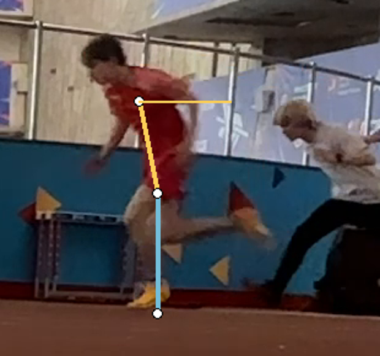

[Открыть кадр с подписями углов](assets/starts-2026-10-04/annotations/red-low-contact-2.png)

Уже ко второй-третьей области опоры туловище почти вертикально. Исходная стойка сжатая и глубокая. Усилие и намерение этой попытки неизвестны: если это демонстрация двух шагов, она не доказывает ошибку твоего максимального старта.

**Пример другого твоего действия: вторая опора после Falling.**

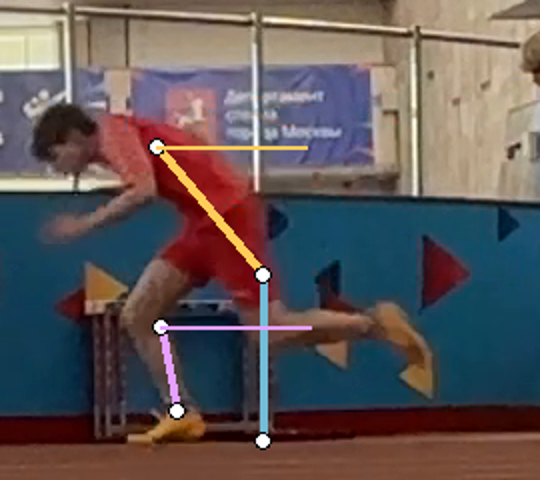

[Открыть кадр с подписями углов](assets/starts-2026-10-04/annotations/red-contact-2.png)

Здесь наклон сохраняется дольше. Это полезный пример ощущения продвижения, но Falling и низкий старт не обязаны совпадать по углам; ракурсы тоже различаются.

**Команда: «Из стойки уходи вперёд».** До попытки слегка поднять таз, почувствовать обе стопы. Ощущение: грудь и пояс уходят в разгон вместе, без отдельного вставания с корточек.

**Проверка:** настоящий 3-point до 10 м, первый повтор без новой команды, второй с одной. Сравнить первые три опоры. Не держаться искусственно низко и не назначать длину первого шага.

[Демонстрация 3-point](https://www.youtube.com/watch?v=dgewJyq8ZFc) · [Первичный обзор механики старта](https://doi.org/10.1007/s40279-019-01138-1). Числовые команды демонстратора не являются обязательными целями.

## 6. Друг: проверить вторую стопу и продолжение разгона

**Как у тебя: вторая область опоры после 3-point.**

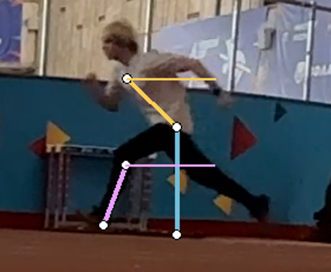

[Открыть кадр с подписями углов](assets/starts-2026-10-04/annotations/white-contact-2.png)

Бег направлен влево. Стопа находится впереди колена; голень отклонена назад по ходу бега. Это повод проверить, не тянешься ли стопой за большим шагом. Центр массы и тормозящая сила не измерены. К четвёртой опоре корпус почти вертикален.

**Какое действие пробуем:**

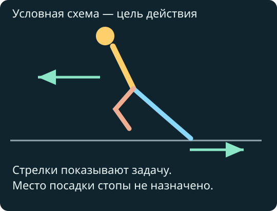

**Команда: «Толкни дорожку назад — унеси тело вперёд».** Ощущение продвижения всем телом. Не доставать дорожку далеко вынесенной стопой и не пытаться поставить её обязательно сзади таза на каждом шаге.

**Проверка:** два сопоставимых 3-point на 10 м с боковой съёмкой. Проверить вторую постановку и движение на следующих опорах. Если изменился только внешний вид, а ускорение не улучшилось, команда ещё не подтверждена.

[3-point и разгон](https://www.youtube.com/watch?v=AYLad378i30) · [Изменение механики по ходу ускорения](https://doi.org/10.1242/bio.20148284). Стартовая готовность уже пригодна; садиться глубже не требуется.

## 7. Push-Up: сейчас основной практикой оставить 3-point

**Как у вас:** сначала опора руками и организация ног с пола, затем выход. У красного часть первых контактов закрывают пробегающие люди; у друга низкое начало не предотвращает быстрый подъём корпуса.

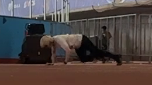

**С чем сравниваем: своя готовность друга в 3-point.**

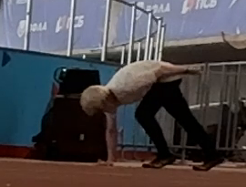

Это реальный пример исходной готовности, не доказательство идеального старта; стопы у края кадра. Из 3-point проще повторить одну стойку и проверить названные выше ошибки. Поэтому сейчас выбираем его основным для обоих.

**Команда остаётся прежней для вашего старта; новых замечаний не добавляем.** Если сравнивать Push-Up, заменить им один назначенный 10-метровый повтор и снять без перекрытий. Не добавлять новую серию.

**Проверка:** стало ли лучше следующее обычное ускорение, а не просто ниже первая поза. Превосходство Push-Up или 3-point по времени у вас не измерено.

[Демонстрация Push-Up](https://www.youtube.com/watch?v=Wgrmhx6EIE4) · [Демонстрация 3-point](https://www.youtube.com/watch?v=dgewJyq8ZFc).

## На следующее занятие

Оставлены пять упражнений: Hold, March, Single Switch, Falling, 3-point. [Точные повторы, паузы, обувь и условия сокращения](../plans/next-start-session.md). Они заменяют прежний стартовый блок.

У каждого три команды по месту: **свой выход вперёд**, **«колено вперёд, не к животу»**, **«сменил — замри»**. Во время одного повтора — одна. Сантиметры шагов, кисти и пальцы сейчас не исправляем.

[Полный отчёт по 14 пунктам](2026-10-04-starts.md) · [Ты](athlete-a/2026-10-04-starts.md) · [Друг](athlete-b/2026-10-04-starts.md) · [Карта освоения](../docs/athletics-map.md) · [Источники и статус просмотра](../docs/start-sources.md).
