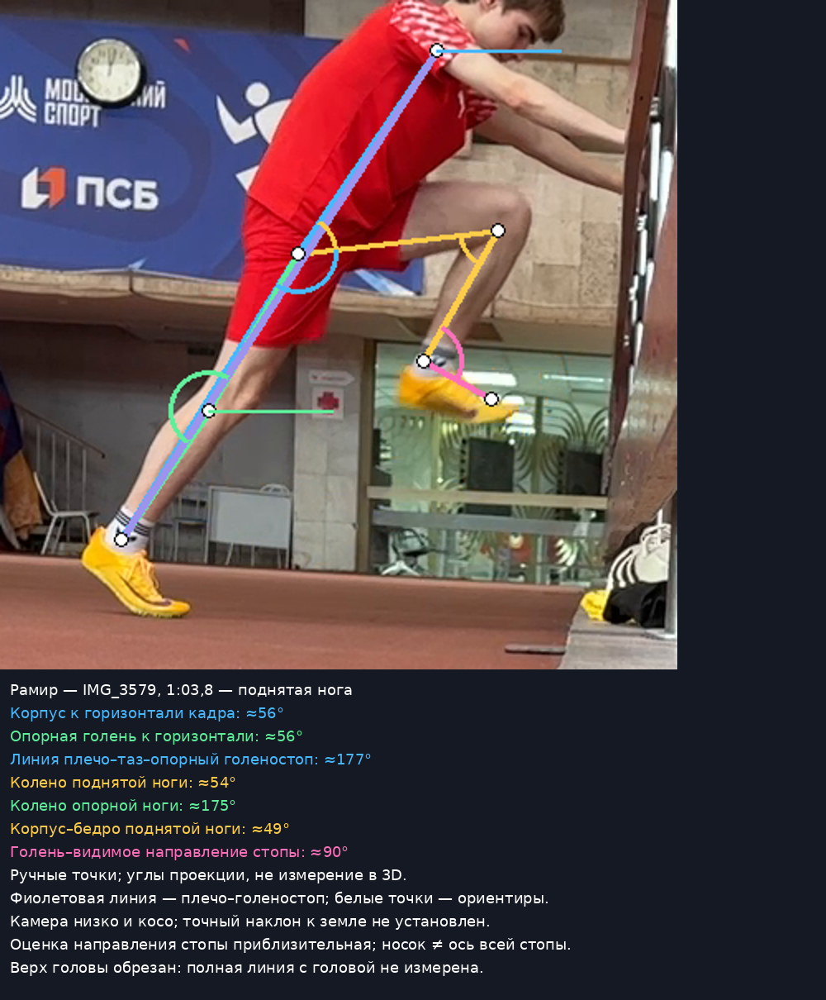
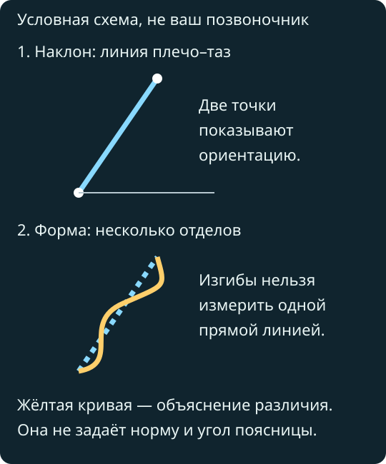

# Старт без колодок: разбор двух участников

Разобрано 4 октября 2026 года; объяснения и имена уточнены 5 октября. **Дата занятия и наличие замедления неизвестны.** Пользователь подтвердил: Рамир — в красном, Миша — с белыми волосами. Это новая [папка Drive](https://drive.google.com/drive/folders/1yTync_-P6z9N_7nbH60sLceb0E6Wykg1), а не прежняя папка со СБУ. Факты занятия записаны отдельно: [Рамир](../sessions/athlete-a/2026-10-04-starts-reported.md), [Миша](../sessions/athlete-b/2026-10-04-starts-reported.md).

**Основной вывод:** у стены исходная линия у обоих пригодна. Главная задача там — изменить характер подъёма и действительно выполнить прямую быструю смену. У Рамира выход без руки и выбранный низкий старт заметно различаются: в Falling нет такого резкого выпрямления в первых трёх опорах, как в выбранной низкой попытке. Низкую попытку нужно повторить с ясно заданным разгоном до 10 м, прежде чем считать этот признак устойчивой ошибкой. У Миши в выбранном 3-point стопа на второй опоре оказывается впереди колена, а к четвёртой опоре туловище почти вертикально. Это основания для двух проверок — постановки стопы и продолжения разгона; по этим видео нельзя измерить тормозящую силу или доказать потерю времени.

## Объём и надёжность просмотра

В списке папки было 10 записей; три IMG_3580 с одинаковым именем/размером являются кандидатами на дубли, но без полного хеша тождество не доказано. Обзор сделан по восьми выбранным источникам, затем просмотрены плотные последовательности отдельных попыток. Это **разбор выбранных попыток, не всех повторений каждого длинного файла**. Два первоначальных извлечения оборвались; обзор дополнен повторными выборками. Короткий IMG_3585 показывает пол/перекрытие и для техники непригоден.

| Файл / фрагмент | Что действительно видно | Что не установлено |
| --- | --- | --- |
| IMG_3579, выбранные участки у стены около 1:01–1:06 и 1:40–1:45 | Удержания и подъёмы Рамира; возвращение к двум стопам между подъёмами | Все повторения и наличие Single Switch в других местах |
| IMG_3580, около 1:08–1:16 и 1:42–1:47 | Подъёмы Миши у стены, в том числе через две опоры | Нельзя считать всю запись серией быстрых смен |
| IMG_3581, около 0:19–0:23 и 0:30–0:34; IMG_3583, выбранные положения | Дополнительные Wall-положения обоих | Нет отдельного полного аудита каждой смены |
| IMG_3587, Рамир около 1:35–1:37 | Выход без руки из наклона, вариант Falling Start; первые пять опор | Точная интенсивность, дистанция, длительность в реальном времени |
| IMG_3587, Миша около 1:04 | Объяснение/демонстрация с шагами и жестами | Не оценивается как полноценная попытка Falling на скорость |
| IMG_3588, около 1:57–2:02 | Оба начинают лёжа/из низкой опоры руками: Push-Up / prone start | У Рамира часть первых опор закрывают пробегающие люди; отдельные стопы Миши сливаются с сумкой |
| IMG_3589, Миша около 1:05–1:07 | 3-point: одна рука, разножка, выход и следующие опоры | Первый контакт частично закрыт; точный центр массы не измерен |
| IMG_3589, Рамир около 3:56–3:58 | Низкая стойка с опорой рукой, выход и пять опор; свободная рука отделяется от опорной | Часть стойки у края кадра; намерение продолжать быстрый разгон неизвестно |

4-point с двумя руками в окончательной готовности и Reaction Start по случайному звуку отдельно не подтверждены. Подготовительная постановка обеих рук ещё не доказывает 4-point. Точные 10/20/30 м по этим изображениям не размечены. Названия упражнений — результат просмотра, не перенос списка из сообщения.

Кадры первоначально сохранены в местной `media/start-review-2026-10-04/`; целые исходные ролики не сохранены. Часть байтов получена по HTTP Range. Изображения не отражались, стороны ног не менялись. В IMG_3588 исправлена ориентация только производных после визуальной проверки; оригинал не менялся. Позднейшим сообщением «В паблик все лей» пользователь разрешил открытое размещение: выбранные собственные производные скопированы в `reviews/assets/`, исходная медиапапка остаётся исключённой из Git. [Версия для телефона с парами «как у нас → что пробуем»](2026-10-04-starts-phone.md), [GitHub Pages](https://ramchike.github.io/athletics-reviews/starts/).

## 1. Что вы сейчас делаете правильно

- **Оба, Wall Hold:** плечо, таз и опорный голеностоп образуют близкую к прямой линию. На выбранных положениях нет большого складывания в тазу. Опорная нога почти разогнута; требовать насильно заблокировать колено не нужно. Это пригодная основа управления позой, хотя перенос в скорость ещё не доказан.
- **Рамир, Falling:** первые опоры не превращаются сразу в вертикальный бег. Корпус остаётся наклонённым, колено первой опорной ноги находится впереди её голеностопа по направлению бега. Руки включаются в выход; виден возврат задней ноги. Не видно необходимости сознательно удлинять первый шаг.
- **Миша, 3-point:** в готовности таз поднят относительно плеч; начало движения действительно идёт вперёд, рука освобождается и начинается работа рук. Это не выход из упора лёжа и не просто «встал — пошёл».
- **Оба:** после выхода видна смена ног, а не серия прыжков двумя ногами. Это конкретное наблюдение, не подтверждение оптимального толчка, скорости или силы.

## 2. Три главных направления исправления Рамира

1. **Низкий старт быстро превращается в высокий бег.** В выбранной низкой попытке туловище меняется примерно от 63° на первой области опоры до 79° на второй и 87° на третьей относительно горизонтали кадра. Исходная стойка выглядит как глубокий присед. В Falling такого же быстрого перехода нет. При задаче разгоняться до 10 м это приоритет: слегка поднять таз в готовности и выходить вперёд, а не сначала вставать с корточек. Связь приседа с подъёмом — гипотеза; усилие попытки неизвестно, поэтому это не диагноз всех твоих стартов.
2. **В Wall-положении колено сильно приведено к туловищу.** Угол плечо–таз–поднятое колено около 49°, поднятое колено согнуто примерно до 54°. Линия корпуса при этом сохраняется. Для выбранной прогрессии Landow положение более сжатое, чем его демонстрация. Попробовать вести колено вперёд и остановить подъём раньше; не поднимать ещё выше ради «сильной работы». Это коррекция под задачу упражнения, не универсальное требование к высоте колена в беге.
3. **Просмотренные подъёмы не выполняют задачу Single Switch.** Между верхними положениями есть остановка на двух стопах. Медленное обучение так делать можно; быстрая прямая смена требует другой попытки: одна смена — короткая фиксация. Не объявляю, что во всей папке нет правильной смены.

Укороченный толчок, слабость конкретной мышцы, избыточно длинный первый шаг и прогиб поясницы как главные ошибки у тебя не подтверждены. Не заменяю ими пункты выше.

## 3. Три главных направления исправления Миши

1. **Проверить постановку второй стопы, которая достаёт дорожку впереди колена.** На размеченной второй опоре голень отклонена назад относительно направления бега, стопа заметно впереди таза. Это кандидат на излишнее вытягивание стопы вперёд. Само положение впереди таза ещё не доказывает overstriding — чрезмерно далёкую постановку с потерей разгона: центр массы и силы не измерены. Проба: уходить телом вперёд и опускать ногу, не искать большой шаг стопой.
2. **Проверить ранний переход в почти вертикальную позу.** На третьей области опоры туловище около 74°, на четвёртой около 81°. Начальная стойка низкая, но она не обеспечивает длительный разгон сама по себе; сходный быстрый подъём виден после Push-Up. Проверяем продвижение вперёд на следующих шагах. Не удерживать голову вниз и не пытаться искусственно ползти ниже.
3. **У стены разделить управление позой и быструю смену.** Верхнее положение тоже сжатое: плечо–таз–колено около 58°, поднятое колено около 58°. В просмотренных сериях есть промежуточная остановка на двух стопах. Для следующей тренировки одна задача: колено вперёд, затем непосредственная одиночная смена с сохранением линии.

Первые два пункта — наблюдаемые признаки с гипотезой об их влиянии, а не доказанные причины плохого времени. Величина выигрыша после исправления неизвестна.

## 4. Углы и линии на ключевых стоп-кадрах

Все числа ниже — **углы на плоском изображении**. Камера низко и косо, поэтому достоверность абсолютных углов к дорожке низкая; общую линию и грубое изменение позы оценивать можно увереннее. Разницу в 4–6° между людьми считать техническим превосходством нельзя. Голова Рамира сверху обрезана; полную линию «голова–плечо–таз–стопа» для него не измерить. Для Миши положение шеи видимо, но ось головы не равна продолжению всех сегментов тела.

| Что измерено и как | Рамир | Миша | Что это означает |
| --- | --- | --- | --- |
| Плечо–таз к горизонтали кадра | ≈56° | ≈52° | К вертикали кадра соответственно ≈34° и ≈38°. Точный угол к земле неизвестен |
| Опорное колено–голеностоп к горизонтали | ≈56° | ≈59° | Наклон опорной голени; не направление силы |
| Плечо–таз–опорный голеностоп | ≈177° | ≈171° | Близкая к прямой линия; нет большого излома. Не требовать ровно 180° |
| Поднятое бедро к горизонтали изображения | ≈7° вверх к колену | ≈6° вниз к колену | Почти горизонтально на изображении; абсолютная ориентация к полу не откалибрована |
| Плечо–таз–поднятое колено | ≈49° | ≈58° | Геометрический угол корпуса и бедра. Не клинический угол сгибания тазобедренного сустава |
| Таз–поднятое колено–голеностоп | ≈54° | ≈58° | Поднятая нога сильно согнута. Это не 90°, но универсальной нормы для этого drill не найдено |
| Таз–опорное колено–голеностоп | ≈175° | ≈177° | Почти прямая опорная нога без требования насильно выпрямить её |
| Поднятая голень–видимое направление стопы | ≈90° | ≈89° | Грубый ориентир: носок обуви не ось стопы, точность здесь особенно низкая |

Чувствительность к ручной разметке: при смещении каждой точки на ±3 пикселя по каждой оси угол туловища Рамира меняется примерно в пределах 52–59°, Миши 48–56°. Поднятое колено — 48–60° и 51–65°; ориентир голеностопа — 77–103° и 72–107°. **Это проверка чувствительности, не доверительный интервал и не компенсация перспективы.** Все координаты и хеши кадров сохранены в местных JSON.

По отношению к [конкретной схеме Landow](https://coachathletics.com.au/coaching-education/three-great-acceleration-drills-loren-landows-drill-progression) ваши поднятые бёдра сильнее приближены к туловищу: автор показывает примерно перпендикулярное расположение бедра к линии тела. Это около 90° в его модели, а не установленный диапазон для всех людей. Для вас выбираем пробу с меньшим подъёмом и проверяем, улучшает ли она смену и выход, вместо погони за числом.

Прогиб поясницы, вращение таза и истинную траекторию центра массы из этих линий не измерить. На выбранных удержаниях явного провала таза не видно; в динамике нужна проверка в строго боковом ракурсе. Направленный вниз носок на фотографии не равен автоматически «брошенной стопе» — ориентир между голенью и обувью близок к прямому углу.

Научный обзор не устанавливает одной оптимальной стартовой комбинации углов. Например, описанное в исследованиях максимальное разгибание колена первой опорной ноги около 160–170° относится к конкретной фазе после старта из колодок, а не к вашему Wall Hold. Оно также не означает, что надо задерживаться на дорожке до 180°. [Bezodis, Willwacher, Salo, 2019](https://doi.org/10.1007/s40279-019-01138-1).

### Спина: наклон туловища не равен изгибу позвоночника

**Рамир, общий наклон у стены подходит для выбранной задачи; специально выпрямлять тело сильнее сейчас не нужно. Миша, у тебя тоже нет большого видимого излома в тазу.** У обоих при этом поднятая нога сжата сильнее выбранной модели Landow: пробуем меньший подъём, чтобы проверить управление ногой и прямую смену, а не менять все сегменты одновременно.

Наклон плечо–таз составляет около 56° у Рамира и 52° у Миши к горизонтали изображения. Это **ориентация туловища**, не угол поясничного прогиба. Углы 177°/171° между плечом, тазом и опорным голеностопом описывают общую линию тела; они также не измеряют позвоночник. Футболка и косой ракурс не позволяют надёжно оценить кривизну отдельных отделов. Поэтому выраженного прогиба не подтверждаю, но и не объявляю его отсутствие доказанным.

Позвоночник не обязан быть геометрически прямой палкой. В исследовании бега на дорожке у 13 любителей измеряли кривизну по отдельным точкам и обнаружили индивидуальные особенности формы; это не исследование ваших Wall drills и не норматив. [Первичное исследование, 2015](https://pubmed.ncbi.nlm.nih.gov/25770754/).

**Что влияет на задачу:** у стены изменение всей позы ради подъёма колена мешает отдельно отрабатывать управление ногой. В Falling важно начать наклон всем телом, а не складывать только грудь к земле. В готовности 3-point сгибание в тазобедренных суставах допустимо: общей прямой «плечо–таз–стопа», как в Wall Hold, здесь не требуем. В Push-Up собирание ног с пола также требует изменения позы. В обоих стартах проверяем продвижение вперёд и переход между опорами; фиксированный угол спины на всех шагах не является целью.

**Как попробовать:** в Wall команда «колено вперёд, не к животу», ощущение — двигается нога, пояс и грудь не помогают ей качанием. Для разгона остаётся основная команда каждого. Отдельно зажимать спину, максимально подкручивать таз или опускать голову сейчас не нужно. Их влияние как главных ограничений у вас не подтверждено.

Для проверки формы спины нужен строго боковой кадр в облегающей одежде: Hold, три March каждой ногой и первые опоры старта. Обычное видео позволит увереннее оценить видимое изменение, но не заменит анатомическое измерение позвоночника. [Подробная карточка для телефона](2026-10-04-starts-phone.md#back) · [Основания и ограничения](../docs/back-and-trunk.md).

## 5. Что менять в Wall drills

**Hold.** Сохранить: опора руками, цельная линия, устойчивый таз. Изменить пробно: не прижимать поднятое бедро ещё ближе к животу. Колено направляется вперёд, а верхняя точка определяется сохранением корпуса и задачей начала разгона. Не опускать таз, чтобы удобнее поднять ногу. Ощущение: нога двигается отдельно, грудь и пояс остаются собранными.

**March.** Отделить подъём от качания корпуса: поднял — зафиксировал — контролируемо вернул. Сначала обе стороны на умеренной высоте. Пауза на двух стопах допустима как упрощение обучения, но не выдавать её за точную механику быстрого переключения опоры. Не увеличивать число повторений только потому, что они медленные.

**Single Switch.** Начинать уже с одной ногой наверху. По команде непосредственно поменять опору и замереть на 1–2 с. Подготовка и возврат могут быть медленными; сама смена должна быть быстрой. Если таз падает или ноги запутываются, снизить число смен, уточнить исходную позу и вернуться к March. Не заменять Switch быстрым маршированием через отдельную остановку.

Обязательна проверка переноса: после короткого блока у стены снять обычное ускорение. Стена снимает часть задачи равновесия и не воспроизводит разгон всего тела, работу рук и реальные силы контакта. Красивое удержание не доказывает улучшение 10 м.

## 6. Что менять в Falling Start

**Рамир:** выбранный выход пригоден как подводящее упражнение. Перед первым движением есть сгибание коленей/организация опоры; это не чистое пассивное падение идеально прямого тела. Если задача именно Falling, начать из более спокойной вертикальной стойки, позволить всему телу наклониться от голеностопа и перейти в шаг без отдельного приседания. Не считать небольшое естественное сгибание коленей запрещённым. Главная команда: **«Падай целиком и уходи вперёд»**. В первых опорах не вижу причины предписывать более длинный шаг или держаться ниже.

**Миша:** просмотренный короткий эпизод с шагами и жестами не оценивается как качественный спринтерский Falling. Нужны две ясно обозначенные попытки с переходом в настоящий разгон. Упражнение в плане — проверка цельного выхода, не установленное лечение его ошибки.

Камера показывает продвижение таза и туловища вперёд. Истинный центр массы всего тела не рассчитан; формулировка «центр массы ушёл на X сантиметров» здесь была бы выдумкой.

## 7. Что менять в Push-Up Start; сравнение с 3-point

Оба действительно начинают низко с опорой руками, затем организуют ноги и переходят в бег. Это отдельная задача подъёма с пола. Подъём таза при сохранении рук на земле сам по себе не равен выпрыгиванию вверх; важно, куда направлен выход после освобождения рук.

**Рамир:** видна дополнительная стадия собирания ног под тазом и сгибания корпуса до выхода. Часть следующих опор закрыта пробегающим человеком. По такой попытке не заключаю, что у тебя плохая работа задней ноги или слабые руки. Для текущей цели 3-point полезнее как основная практика: он позволит повторить одинаковую готовность и проверить проблему быстрого выпрямления после низкой стойки. Falling уже показывает более устойчивый наклон; больше Push-Up не требуется без свидетельства, что он улучшает следующий обычный старт.

**Миша:** Push-Up не устраняет быстрый переход к высокой позе. В выходе руки широко расходятся; косой ракурс не позволяет назвать это главным ограничителем. Сейчас также выбирать 3-point основным, потому что в нём проще проверить вторую постановку стопы и продолжение разгона. Push-Up может остаться позже короткой пробой, если даёт именно продвижение вперёд без отдельного вставания.

Личное превосходство по времени не проверено: сравнения 5/10 м при одинаковых условиях нет. Контролируемого прямого доказательства «Push-Up лучше 3-point для таких новичков» в исследованном материале не найдено. Решение оставить 3-point — тренерская проба под наблюдаемую задачу.

## 8. Что менять в 3-Point Start

**Рамир:** окончательная стойка выглядит сжатой и глубокой, часть ноги выходит за край кадра. Не переноси сюда идею «чем ниже сяду, тем лучше старт». Попробуй немного поднять таз без переноса всей нагрузки на руку, почувствовать обе стопы и уйти грудью и тазом вперёд. Не нужно сначала выпрямляться, чтобы начать бег. Положение руки/стоп проверяем после полного бокового кадра; точные расстояния между стопами не назначены.

**Миша:** положение готовности пригодно: таз выше плеч, одна рука на дорожке. Не нужно опускать таз ради большего сходства с приседом. Первые действия направлены вперёд, но вторая постановка и быстрое повышение туловища требуют проверки. Проба: толкать дорожку назад и продолжать уносить тело вперёд, не доставать дорожку далеко вынесенной стопой.

В обоих случаях задняя нога должна участвовать в выходе и своевременно переходить вперёд. По вашим кадрам виден её возврат, но величина усилия неизвестна. Не требовать специально скрести носком по дорожке или полностью выпрямить колено перед отрывом. Руки работают с начала освобождения опоры; форму кистей пока не корректируем.

Старт без педалей не воспроизводит весь старт из колодок. После появления колодок отдельно освоить настройку, нагрузку на обе педали, готовность и освобождение опор; заменить часть текущих повторов, а не добавлять целый второй стартовый блок. [Обзор кинетики и кинематики старта](https://doi.org/10.3390/ijerph19074074).

## 9. Первые 3–5 контактов

Контакт №1 — первая новая постановка стопы после выхода, не исходная передняя опора. Момент касания найден по соседним кадрам приблизительно; размеченные изображения иногда показывают раннюю опору, а не её первую миллисекунду. Анатомические правая/левая стороны при перекрытиях не назначены. Слова «опорная» и «задняя при старте» не смешиваются.

### Рамир: Falling / выход без руки

| Фаза | Что видно и что изменить |
| --- | --- |
| Исходная поза | Стойка без руки, наклон и сгибание коленей перед выходом. Для чистого Falling пробовать меньше предварительного подседания; отдельной ошибки «сломан пополам» по этой позе не подтверждаю |
| [Контакт 1](assets/starts-2026-10-04/annotations/red-contact-1.png) | Туловище ≈58°, голень ≈45° к горизонтали кадра; колено впереди голеностопа по ходу бега. Стопа не вытянута далеко перед тазом. Сохранять организованный выход; не удлинять шаг ради отметки |
| [Контакт 2](assets/starts-2026-10-04/annotations/red-contact-2.png) | Туловище ≈50°, голень ≈79°. Стопа впереди таза, но туловище тоже впереди: это не доказательство торможения. Новой отдельной команды не требуется |
| [Контакт 3](assets/starts-2026-10-04/annotations/red-contact-3.png) | Туловище ≈60°, голень близка к вертикали изображения. Руки и смена ног продолжаются; резкого вставания в вертикаль ещё нет |
| [Контакт 4](assets/starts-2026-10-04/annotations/red-contact-4.png) / [5](assets/starts-2026-10-04/annotations/red-contact-5.png) | Туловище выше, примерно ≈68°. Видим постепенный переход, а не требование держать одинаковый наклон на всех шагах. Не мешать этому сознательным опусканием головы |
| Дальше / 5–10 м | Бег продолжается; сами отметки дистанции и скорость неизвестны. Нет оснований назвать нормальной измеренную длину шагов — она не измерена. Механически явного запроса сознательно менять её в этой попытке нет |

Рассмотрена последовательность перед опорой, в опоре и после отрыва. Не вижу убедительного доказательства обрывания толчка; нельзя измерить его качество по тому, что колено не разогнулось до 180°. Не удерживать ногу сзади нарочно.

### Рамир: выбранный низкий старт

Верхний ряд — выход без руки, нижний — выбранный низкий старт. Сравнение показывает изменение позы внутри последовательностей. Ракурсы и усилие различаются: это не точное сопоставление углов двух равноценных максимальных попыток.

| Фаза | Что видно и что изменить |
| --- | --- |
| Готовность | [Исходный кадр](assets/starts-2026-10-04/3589-red-low-actual/frame-0000.png): глубокая сжатая стойка, задняя часть частично у края. Пробовать выше таз и больше готовности уйти вперёд |
| [Контакт 1](assets/starts-2026-10-04/annotations/red-low-contact-1.png) | Туловище ≈63°, первый шаг организован, руки свободны. Не требовать длинного первого шага |
| [Контакт 2](assets/starts-2026-10-04/annotations/red-low-contact-2.png) | Туловище уже ≈79°; наклон быстро исчезает. Главная проба — выход вперёд из более удобной стойки |
| [Контакт 3](assets/starts-2026-10-04/annotations/red-low-contact-3.png) | Туловище ≈87°, руки опускаются относительно первых действий. Эта попытка уже мало похожа на решительное продолжение разгона |
| [Контакт 4](assets/starts-2026-10-04/annotations/red-low-contact-4.png) / [5](assets/starts-2026-10-04/annotations/red-low-contact-5.png) | Почти вертикальный бег сохраняется. Не исправлять одновременно всё тело: снять новую попытку с заданием действительно ускоряться до 10 м |

Усилие и исходная задача этой попытки неизвестны. Если это намеренно короткая демонстрация двух шагов, её ранний подъём не доказывает ошибку в полноценном спринте. Для задачи пользователя «технически устойчиво ускоряться» она пока не является подтверждением переноса.

### Миша: 3-point

| Фаза | Что видно и что изменить |
| --- | --- |
| Готовность | [Кадр готовности](assets/starts-2026-10-04/3589-white-exit-actual/frame-0000.png): таз выше плеч, одна рука. Глубокую подготовку за несколько секунд до этого не оценивать как окончательное положение |
| [Область контакта 1](assets/starts-2026-10-04/annotations/white-contact-1.png) | Туловище ≈39°, продвижение вперёд и работа рук. Стопа скрыта сумкой: точный момент и угол голени неизвестны. Не диагностировать длинный первый шаг |
| [Контакт 2](assets/starts-2026-10-04/annotations/white-contact-2.png) | Туловище ≈44°, голень ≈70° к горизонтали, но наклонена назад по ходу бега: стопа впереди колена. Проверить, не достаёшь ли землю стопой раньше, чем тело успело продвинуться |
| [Область контакта 3](assets/starts-2026-10-04/annotations/white-contact-3-final.png) | Туловище около ≈74°, стопа заметно впереди таза. Колено/голеностоп на этой небольшой чёрной фигуре надёжно не локализованы: численный угол голени не опубликован. Продолжать проверять движение всего тела вперёд |
| [Опора 4](assets/starts-2026-10-04/annotations/white-contact-4-final.png) / [5](assets/starts-2026-10-04/annotations/white-contact-5-final.png) | Туловище ≈81–82°, почти вертикально. Это ранняя потеря выраженного наклона в выбранной попытке. Насильно сохранять низкую позу не надо; проверить, продолжается ли решительное ускорение |
| Дальше / 5–10 м | Бег продолжается, но скорость и отметки неизвестны. Нельзя сказать, что каждый следующий шаг ускоряет тебя, по одному перемещению в кадре |

На второй и третьей областях опоры проверить возможное излишнее вытягивание стопы, но не назначать «укоротить шаг на X см». В ускорении положение стопы относительно центра массы меняется; требование всегда ставить её позади таза ошибочно. [Nagahara et al., 2014](https://doi.org/10.1242/bio.20148284), [Bezodis et al., 2019](https://doi.org/10.1007/s40279-019-01138-1).

### Оба: первые опоры после Push-Up

[Непрерывная выборка выхода](assets/starts-2026-10-04/pushup-partial-visible.jpg) дополнена последовательностью соседних кадров, не только этой обзорной таблицей.

| Фаза | Рамир | Миша |
| --- | --- | --- |
| Исходное положение | Лёжа, затем опора руками | Лёжа, затем опора руками |
| Организация первого шага | Таз поднимается, ноги собираются под него, потом руки освобождаются | Подводится нога, после опоры руками начинается выход вперёд |
| Первая новая опора | Подвижный переход виден, точную постановку частично закрывают другие люди | Область контакта частично закрыта сумкой и чёрной одеждой |
| Вторая и третья | Бег начат; перекрытия не позволяют надёжно сравнить голени и окончание каждого толчка | Туловище быстро становится выше, руки участвуют; явного удержания низкого разгона за счёт упражнения нет |
| Четвёртая и пятая | Нельзя честно пронумеровать каждый контакт через перекрывающего бегуна. Нужна повторная съёмка | Последующее высокое положение видно; точная нумерация при маленькой фигуре ненадёжна. Нужен боковой клип |

Таким образом, по пять опор каждого **в каждом типе старта** материал не позволяет надёжно закрыть. Для пригодных Falling/низких попыток опоры разобраны; закрытые Push-Up не достраиваются воображением.

### Длина, частота, окончание толчка

Сантиметры шагов не вычислены: нет проверенного масштаба в плоскости бега. Частота, длительность опоры и истинная скорость не вычислены: неизвестно замедление при съёмке/экспорте. Заметные различия длины на экране смешаны с перспективой. Вывод «ноги быстро двигаются» нельзя превращать в число шагов в секунду.

У Рамира Falling нет явного запроса сознательно удлинять или укорачивать шаг. У Миши в 3-point есть кандидат на излишнее вытягивание стопы; меняем действие и проверяем результат, а не сантиметры. Ни у кого не доказано, что короткие шаги вызваны недостаточным завершением толчка. Нарастающее торможение также не измерено. Задняя нога возвращается, руки работают; микроисправления кистей сейчас уступают задаче выхода и продолжения ускорения.

## 10. Какие 3–5 упражнений оставить на следующую тренировку

Оставить пять: **Hold → March → Single Switch → Falling → 3-point**. Первые три занимают короткий учебный блок, последние два проверяют настоящее продвижение.

| Упражнение | Конкретная задача для вас |
| --- | --- |
| Hold | Сохранить уже пригодную линию при менее сжатом положении поднятой ноги |
| March | Найти повторяемую высоту без качания таза; подготовить исходное положение Switch |
| Single Switch | Исправить возврат через длительную остановку на двух стопах, если целью была быстрая смена |
| Falling | Рамиру — сохранить пригодный выход; Мише — проверить цельный выход без низкой стойки |
| 3-point | Рамиру — проверить раннее выпрямление именно из низкой стойки; Мише — постановку второй стопы и продолжение разгона |

2-point использовать как замену 3-point, если новая стойка мешает понять продвижение, а не как шестой обязательный блок. Push-Up, 4-point и Reaction пока не добавлять: лишние варианты осложнят проверку. Это не объявление упражнений бесполезными навсегда. Новых прыжков, санок или резинок сейчас не требуется: по видео не установлена проблема, для которой они необходимы. Сопротивление не показало универсального преимущества над обычным ускорением во всех сравнительных исследованиях. [Aldrich et al., 2024](https://doi.org/10.70252/vkav1115).

## 11. Точный пробный объём каждого упражнения

Это **будущий условный план**, не восстановление неизвестной нагрузки сегодняшнего занятия. Подробная обувь, условия сокращения и сумма метров — в [плане](../plans/next-start-session.md).

| Работа | Каждому / отдельно | Отдых |
| --- | --- | --- |
| Hold | 2 × 8 с с каждой поднятой ногой: 4 удержания, 32 с | 20–30 с между удержаниями |
| March | 2 × 3 подъёма каждой ногой: 12 подъёмов всего; фиксация 1–2 с | 45–60 с между подходами |
| Single Switch | 2 × 2 смены с каждой исходной поднятой ногой: 8 смен всего | 10–15 с для нового исходного положения; 60 с между подходами |
| Falling | 2 × 10 м | 2 мин |
| 3-point, Рамир | 3 × 10 м + до 2 × 20 м при готовности | 2–3 мин на 10 м; 3–4 мин на 20 м |
| 3-point, Миша | 3 × 10 м + до 1 × 20 м при готовности | Те же паузы |

Разная верхняя доза — консервативная проба из-за меньшей полноты индивидуальных данных Миши, не заключение о его силе. При неизвестной готовности начать с 3 × 10 м без обязательного удлинения. Подводящие ускорения отдельно: 3 × 20 м в кроссовках, 60–90 с. При полной таблице основные ускорения составят 90 м / 70 м, с подводящими 150 м / 130 м. Метры в шиповках при указанной обуви 70 м / 50 м; Wall и Falling — в кроссовках. Новый вариант заменяет прежние 4 × 20 + 2 × 40, не прибавляется к ним.

Качественный отдых и повторяемое намерение ускориться важнее заполнения трёх часов манежа. Эти числа не являются установленным исследованием индивидуальным оптимумом. Перед выполнением учитывать актуальное восстановление каждого и нагрузку ног за 48–72 часа.

## 12. Короткие команды каждому

На одно повторение выбирайте **одну** главную команду.

| Рамир | Миша |
| --- | --- |
| В низком старте: **«Из стойки уходи вперёд»**. Перед попыткой отдельно слегка поднять таз и проверить удобство обеих стоп | В старте: **«Толкни дорожку назад — унеси тело вперёд»**. Ощущение продвижения, без вытягивания стопы ради большого шага |
| У стены: **«Колено вперёд, не к животу»**. Остановить подъём раньше, сохранив пояс | Та же Wall-команда; не копировать высоту чужого колена |
| В Switch: **«Сменил — замри»**. Смена непосредственная и быстрая | В Switch: **«Сменил — замри»** |

В Falling Рамиру можно использовать «падай целиком» вместо стартовой команды, не добавляя четвёртое одновременное замечание. Образ движения считается удачным только если следующая попытка действительно меняется полезно. Внешние команды в среднем могут помогать спринту, но эффект конкретной команды для вас ещё нужно проверить. [Li et al., 2022](https://doi.org/10.3390/ijerph19106254).

## 13. Что пока не исправлять

Не назначать длину первых шагов, не гнаться за 45° корпуса, не держать голову специально низко, не вытягивать колено до 180° перед отрывом, не требовать носок обязательно смотреть вверх в каждом кадре. Пальцы, кисти, точный угол локтя, положение большого пальца и микроположение головы сейчас не приоритет. Поясницу и силу мышц не диагностировать по силуэту.

Не пытаться стать точной копией Lyles или Борзова: скорость, сила, антропометрия и опоры другие. При этом нельзя оправдывать устойчивую потерю задачи словами «пока делаю плохо, мышцы сами научатся». Hold/March можно замедлить; Switch требует скорости самой смены; обычное ускорение должно включать настоящее быстрое движение. Небольшие ошибки допустимы, повторяющийся отказ от целевого действия требует упрощения. На следующем занятии проверить повтор **без подсказки** — только тогда есть свидетельство обучения, а не разового исполнения команды. [Guadagnoli & Lee, 2004](https://doi.org/10.3200/jmbr.36.2.212-224).

## 14. Какие кадры и ракурсы переснять

Съёмку встроить в назначенные повторы, не добавлять отдельную полноценную нагрузку ради камеры.

- **У стены каждому:** полный человек сбоку, камера на высоте таза, оптическая ось примерно перпендикулярна плоскости движения; не у пола и не из угла. Одна запись с Hold на обе стороны, медленным March и четырьмя отдельными Switch — все фиксации и стопы видны. Сначала проверить, что голова не обрезана.
- **Для стартов:** два назначенных 10-метровых 3-point каждому — первый без новой команды, второй с одной. Боковой неподвижный общий план, включающий исходную стойку, все первые пять контактов и конец 10 м. Стопы не должны сливаться с сумкой; в этой полосе никто не перекрывает спортсмена. Для анализа первого шага отдельно достаточно более близкого кадра первых 3–5 м, если он снят другой камерой в том же повторе.
- **Push-Up:** если хотите окончательно сравнить варианты, заменить один повтор 3-point на один Push-Up, снять непрерывно сбоку с начала опоры руками. Сейчас закрытых опор Рамира недостаточно для честного сравнения.
- **Falling Миши:** обозначить, что это попытка разгона, а не объяснение ходьбой; выполнить внутри двух назначенных повторов.
- **Время и дистанция:** сообщить исходную частоту съёмки и было ли замедление при экспорте. 120/240 кадров/с полезны при достаточном свете, но сама частота не восстанавливает реальное время. Разметить 0/5/10 м вдоль дорожки и одну известную длину в её плоскости; для 20/30 м нужна непрерывная попытка с соответствующими отметками. Не ставить метки обязательной длины отдельных шагов.

Теперь проверены выбранные Wall-положения и первые опоры доступных стартов. **Не доказаны** перенос в время 5/10/20/30 м, повторяемость без команды, истинная частота и полноценная механика колодок. Следующая полезная проверка — одинаковые 10 м без команды и с одной командой, затем повтор без напоминания на следующем занятии. [Карта освоения](../docs/athletics-map.md), [исследование](../docs/start-research.md), [реестр фактически прочитанных источников](../docs/start-sources.md).
