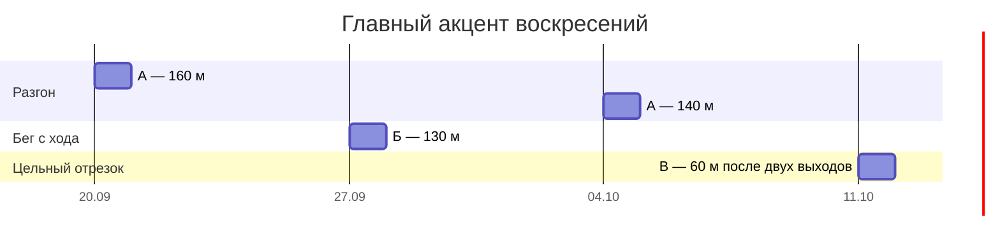

# Как связаны занятия и почему их не измеряем только часами

**Уточнение 4 октября:** текущую задачу первых контактов вести по [новому пробному занятию](programme.json) и [карте освоения техники](../docs/athletics-map.md). Диаграммы ниже сохраняют прежнее предложение, а не подтверждённый календарь выполненной работы. Не прибавлять их нагрузку к новому стартовому блоку.

Обновлено 13 сентября 2026 года после уточнения о трёхчасовом занятии, комфортной усталости и ощущении хаоса. Сейчас базовый график сохраняется: манеж по воскресеньям, зал первого участника во вторник, четверг и субботу. Второй беговой день не согласован. Прыжковых блоков нет.

## Что можно уверенно сказать о длительности

Нет проверенного нами исследования, которое сравнивало бы именно 70-85 минут и три часа в манеже у двух спортсменов с вашей исходной ситуацией. Поэтому фразу «этого точно достаточно» использовать нельзя. На выбранную программу с паузами мы предварительно отводим 70-85 минут. Это оценка времени по её составу, оптимальная продолжительность спринтерского занятия для вас пока не установлена.

Известно, что работа на разгон, более высокую скорость и удержание скорости имеет разные задачи. В обзоре Haugen и соавторов для разгона приведены 100-300 м основной работы и паузы 2-7 минут. При тренировке максимальной скорости объём считают отдельно для быстрых участков после разбега. Это рекомендации из обзора исследований и практики, преимущественно для высокой интенсивности, а не проверенная норма нашего занятия. [Разделы Sprint Training и таблица 2](https://link.springer.com/article/10.1186/s40798-019-0221-0).

Мои 160 м при 85-90% усилия по ощущениям не становятся оптимальными из-за попадания в похожий диапазон метров. Ощущаемое усилие нельзя подставлять вместо измеренного процента скорости. Небольшой объём выбран как предварительный вариант при неизвестном числе ваших прошлых повторов, паузах и восстановлении.

Три часа сами по себе тоже не означают чрезмерную нагрузку. Час мог уйти на объяснения и ожидание или на большое число активных повторений. Вы описали усталость как комфортную, но по этому ощущению нельзя понять, сколько времени заняли упражнения, а сколько объяснения и ожидание. Для оценки нагрузки важнее записать фактические отрезки, усилие и отдых, затем проверить восстановление.

## Чередуем главный акцент

Предлагаю три типа занятия. Буквы А, Б и В ниже обозначают тип тренировочного дня; они не связаны с названиями A-, B-, C-skip. Это организация нашей программы, а не научно доказанная единственная последовательность.

| Тип дня | Главная задача | Предварительная основная работа | Как понять, что отрабатываем |
| --- | --- | --- | --- |
| А. Старт и разгон | Повторить начало бега и продолжение первых шагов | Четыре по 20 м и два по 40 м; 160 м | Смотрим один выход сбоку, работаем с одной подсказкой |
| Б. Бег с хода | Почувствовать быстрые шаги после плавного набора скорости | Два по 20 м и три пробега: 20 м плавного разгона, затем 10 м быстро; 130 м суммарно | На 10-метровом участке наблюдаем ритм и положение тела; не считаем его заведомо максимальной скоростью |
| В. Цельный отрезок и проверка | Связать старт с продолжением бега на дистанции | Два по 20 м и один по 60 м; 100 м | Один сопоставимый замер или учебный пробег, а не рекорд после полной серии других отрезков |

Для каждого дня сначала выполняются разминка, короткий блок знакомых беговых упражнений и подводящие ускорения. Они не входят в приведённые основные метры. Два коротких выхода перед днём Б или В сохраняют практику старта, хотя она не является главным акцентом.

Паузы дня А берём из [карточки ближайшего занятия](first-session.md). В дне Б после 20 м отдыхаем 2,5-3 минуты, перед первым пробегом с хода и между ними 4-5 минут. В дне В после коротких выходов 2,5-3 минуты, перед 60 м 6-8 минут. Это наши начальные ориентиры, при необходимости отдых длиннее. Во время пауз не добавляем упражнения до усталости.

День Б впервые выполняем управляемо, примерно с тем же субъективным усилием 85-90%, что в начальном плане. Пока знакомимся с таким бегом. Достаточно ли этой нагрузки для развития максимальной скорости, ещё неизвестно. Когда условия и переносимость позволяют, отдельно пересматриваем интенсивность. Двадцати метров разбега может не хватить для наибольшей скорости конкретного спортсмена; по первым записям уточняем разгон, одновременно пересчитывая общий объём.

День В может быть учебным. Быстрый контроль на 60 м выполняем только при готовности и сравнимых условиях измерения. Если контроль неуместен, остаётся более лёгкая практика. Отрезки 80 и 100 м дальше заменяют часть основной работы, а не прибавляются поверх всех трёх типов дня.

## Первые четыре воскресенья на диаграмме Ганта

Каждая короткая полоса означает одно воскресное занятие. Промежутки между полосами не означают ежедневный бег. Даты предварительные: при плохом восстановлении повторяем подходящий вариант или облегчаем занятие.

В третье воскресенье выполняем уже предложенный вариант четырёх по 20 м и двух по 30 м, всего 140 м. Второе воскресенье изменено: вместо повторения всего дня А предлагается день Б с меньшим общим числом метров. Так мы меняем содержание, не превращая запрос о длительности в автоматическое увеличение объёма.

Если к 27 сентября нет нужных условий или готовности для пробегов с хода, возвращаемся к переносимому варианту дня А. Изменение акцента не обязано происходить строго по календарю. У друга может быть другое решение по его фактической нагрузке.

## Как это продолжается на 12 недель

| Воскресенье | Главный акцент | Связь с предыдущей работой |
| --- | --- | --- |
| 20.09 | А. Старт и разгон | Упорядочить уже знакомую работу |
| 27.09 | Б. Бег с хода, если готов | Проверить формат плавного разгона и короткого быстрого участка |
| 04.10 | А. Старт и разгон | Вернуться к той же подсказке и сравнить видео |
| 11.10 | В. Один 60 м при готовности | Проверить цельную попытку; не добавлять её к полному дню А |
| 18.10 | А. Разгон | Пересмотреть усилие по накопленным записям |
| 25.10 | Б. Бег с хода | Сравнить с первым днём Б |
| 01.11 | А. Разгон | Закрепить выбранное изменение техники |
| 08.11 | В. Контроль 60 м при готовности | Сопоставить условия и результат |
| 15.11 | Короткий день А | Если выбран старт 21-22 ноября, уменьшить объём |
| 22.11 | Соревнование либо день В | Соревнование и его условия ещё должны быть подтверждены |
| 29.11 | Восстановление по состоянию | Учесть реальное участие в старте |
| 06.12 | В. Продолжение бега | 80 м либо контроль 100 м при готовности, а не оба |

Числа повторов, паузы и варианты замены собраны в [12-недельном плане](12-weeks.md). Диаграмма показывает намерение распределить задачи, а не прогноз присвоения разряда.

## Что занимает время внутри воскресенья

Пример для дня А из актуальной карточки. В полосы основной работы входят отдых, возвращение и короткая подсказка. Это не непрерывный бег в течение 18 минут.

```mermaid
gantt
    title День А — пример с паузами
    dateFormat HH:mm
    axisFormat %H:%M
    section Подготовка
    Лёгкий бег :w1, 10:00, 8m
    Подвижность :w2, after w1, 7m
    A-, B-, C-skip :w3, after w2, 12m
    Плавные ускорения :w4, after w3, 9m
    section Основная задача
    Четыре по 20 м с паузами :s1, after w4, 18m
    Два по 40 м с паузами :s2, after s1, 15m
    section Завершение
    Ходьба и запись :end1, after s2, 10m
```

По этому примеру получается 79 минут. Ранее указанное окно 70-85 минут допускает обычные сдвиги. Добавив переодевание до занятия и спокойный просмотр видео после, можно провести в манеже около двух часов. Специально доводить беговую часть до трёх часов этот расчёт не обосновывает.

## Один беговой день или два

В исследовании 36 молодых футболистов сравнили один и два спринтерских занятия в неделю при одинаковом недельном объёме в течение десяти недель. Значимых различий между группами в измеренных показателях короткого линейного спринта не обнаружили; обе группы улучшились. Но они продолжали обычные футбольные тренировки. Это не доказательство равенства режимов для любого спортсмена и не проверка программы на 60/100 м с одним манежем в неделю. [Исследование 2021 года](https://pubmed.ncbi.nlm.nih.gov/34079162/).

Следовательно, оснований обещать «два дня точно лучше одного» по этой работе нет. Практический смысл второго дня для вас может заключаться в более частом возвращении к навыку и распределении задач. Он не должен просто удваивать недельные метры.

Базовый режим остаётся прежним: вторник - основная работа ног в зале, четверг - умеренная, суббота - преимущественно верх, воскресенье - один беговой акцент. Если появятся площадка и время для второго дня, рассматриваем короткий разгон в четверг до зала, сокращаем работу ног там и пересматриваем воскресенье. Режим с двумя днями потребует отдельного плана. Второй беговой день пока не согласован и в календарь не включён.

## Что проверим вместо обещания «точно нормально»

После занятия сохраняем число и длину отрезков, обувь, отдых, усилие, один видеофрагмент и впечатление о фокусе. На следующие сутки добавляем восстановление. При нескольких сопоставимых записях смотрим, сохраняется ли качество и меняется ли результат. Если план слишком лёгок для полезной практики, это основание пересмотреть его; если качество ухудшается или восстановление мешает следующим занятиям, пересматриваем в другую сторону. Без этих сведений точная индивидуальная оценка была бы выдуманной.
