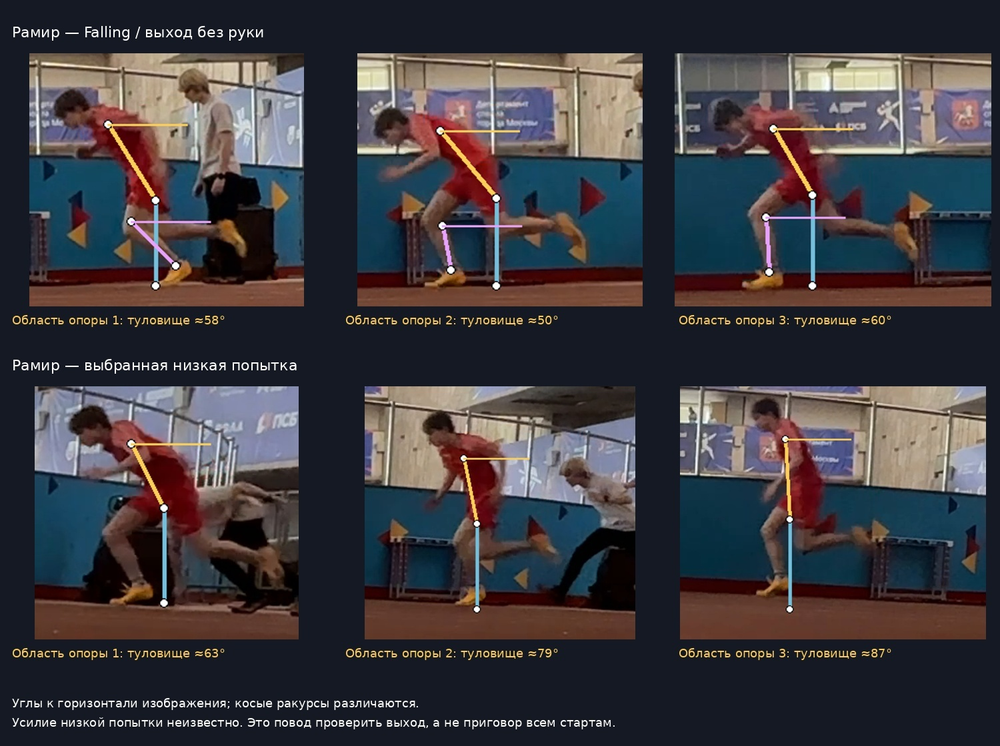

# Рамир: старт и первые опоры

Дата разбора — 4 октября 2026 года; объяснения обновлены 5 октября; дата занятия и замедление неизвестны. Участник подтверждён сообщением пользователя «я в красном». [Полный разбор по 14 пунктам](../2026-10-04-starts.md) относится к новой папке стартов, не к прежнему анализу A/B/C.

**Рамир, в Falling нет резкого вставания на первых трёх опорах — это оставляем. Проверяем выход именно из низкой стойки:** в выбранной низкой попытке уже ко второй-третьей области опоры туловище почти вертикально. Исходная низкая стойка сжатая. Это различие между попытками, а не утверждение, что ты всегда встаёшь рано. Усилие и намерение продолжать быстрый разгон в низкой попытке не сообщены.

**Рамир, по спине:** у стены общего большого складывания в тазу не видно. Измерены 56° к горизонтали кадра / 34° к вертикали, линия плечо–таз–опорный голеностоп около 177°. Эти цифры **не измеряют прогиб поясницы**: линия плечо–таз показывает наклон туловища, а не форму позвоночника. Специально выпрямлять спину сильнее или подкручивать таз сейчас не нужно. Попробуй менее сжатый подъём ноги; ощущение — колено движется, грудь и пояс не помогают качанием. [Что это означает в каждом упражнении](https://ramchike.github.io/athletics-reviews/#/review).

| Фаза низкого старта | Наблюдение | Одна проба |
| --- | --- | --- |
| Готовность | Глубокая стойка с опорой рукой; задняя часть частично у края | Немного поднять таз и почувствовать готовность обеих стоп |
| [Первая опора](../assets/starts-2026-10-04/annotations/red-low-contact-1.png) | Туловище около 63° к горизонтали изображения, первый шаг организован | Уходить из стойки вперёд |
| [Вторая](../assets/starts-2026-10-04/annotations/red-low-contact-2.png) | Около 79°, наклон быстро исчезает | Та же команда, без отдельной работы над длиной шага |
| [Третья](../assets/starts-2026-10-04/annotations/red-low-contact-3.png) | Около 87°, руки опускаются относительно выхода | На повторе задать настоящее продолжение ускорения до 10 м |
| [Четвёртая](../assets/starts-2026-10-04/annotations/red-low-contact-4.png) / [пятая](../assets/starts-2026-10-04/annotations/red-low-contact-5.png) | Высокая поза сохраняется | Проверить эту задачу на новой сопоставимой попытке |

Цифры — грубые углы проекции с ручными точками на одежде, не измерения в 3D. По ним нельзя назначить идеальный угол старта или силу толчка.

У стены пригодная линия: плечо–таз–опорный голеностоп около 177°, опорное колено около 175°. Поднятая нога сжата сильнее, чем в выбранной прогрессии Landow: плечо–таз–колено около 49°, колено около 54°. Пробовать вести колено вперёд и остановить подъём раньше, сохраняя пояс. Не исправлять опорную ногу требованием ровно 180°. В просмотренной серии между подъёмами есть остановка на двух стопах; для Single Switch нужна непосредственная быстрая смена и фиксация.

В Falling нет очевидного запроса сознательно удлинять первые шаги. В Push-Up видна дополнительная организация ног с пола, часть опор перекрывают другие люди. Он не даёт проверенного преимущества для текущей задачи. Основным оставить 3-point; Falling — короткой подводкой, Wall — коротким учебным блоком. Слабость мышц, прогиб поясницы и обрыв толчка как причины не установлены.

Три команды на занятие, по одной на повторение: **«Из стойки уходи вперёд»**, **«Колено вперёд, не к животу»**, **«Сменил — замри»**. Первую применить к настоящему ускорению; остальные только в соответствующих Wall-упражнениях. Положение таза уточнить до попытки, не контролировать десяток деталей во время бега.

[Точный условный план](../../plans/next-start-session.md): Hold 4 × 8 с; March 12 подъёмов; Switch 8 одиночных смен; Falling 2 × 10 м; 3-point 3 × 10 м и до 2 × 20 м при готовности. Паузы, обувь и сумма нагрузки находятся в плане. Это будущая проба, не факт выполненного занятия. [Неполная фактическая запись](../../sessions/athlete-a/2026-10-04-starts-reported.md).

Переснять два назначенных 3-point сбоку, без обрезанных ног и перекрытий: без команды и с одной командой. Показать все первые пять контактов и конец 10 м; сообщить замедление. Нужна проверка без напоминания на следующем занятии. Оригиналы остаются местными; выбранные производные разрешены пользователем для открытого GitHub Pages. [Карточки для телефона](https://ramchike.github.io/athletics-reviews/starts/).
