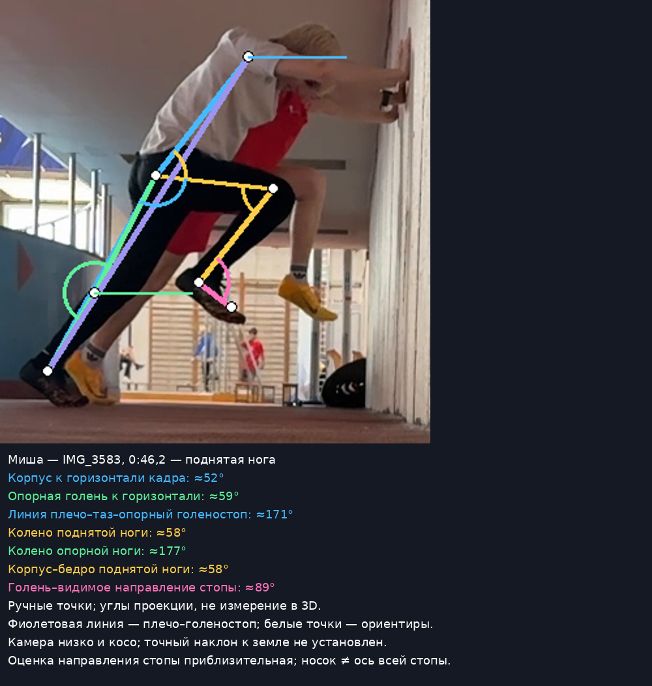

# Миша: старт и первые опоры

Дата разбора — 4 октября 2026 года; объяснения обновлены 5 октября; дата занятия и замедление неизвестны. Пользователь подтвердил, что Миша — участник с белыми волосами. Личные результаты и восстановление остаются неизвестными. [Полный разбор по 14 пунктам](../2026-10-04-starts.md) относится к новой папке стартов.

**Миша, готовность сейчас подходит; проверить нужно вторую постановку стопы и продолжение движения вперёд.** Низкая готовность сама по себе уже получается; её не нужно углублять ради более низкой позы. В выбранной 3-point-попытке вторая стопа касается впереди колена, а к четвёртой области опоры туловище почти вертикально. Влияние на время неизвестно; положение стопы впереди таза не доказывает тормозящую силу.

**Миша, по спине:** у стены общего большого складывания в тазу не видно. Измерены 52° к горизонтали кадра / 38° к вертикали, линия плечо–таз–опорный голеностоп около 171°. Эти цифры **не измеряют прогиб поясницы**: линия плечо–таз показывает наклон туловища, а не форму позвоночника. Специально выпрямлять спину сильнее или подкручивать таз сейчас не нужно. Попробуй менее сжатый подъём ноги; ощущение — колено движется, грудь и пояс не помогают качанием. [Что это означает в каждом упражнении](https://ramchike.github.io/athletics-reviews/#/review).

| Фаза 3-point | Наблюдение | Одна проба |
| --- | --- | --- |
| Готовность | Таз выше плеч, одна рука на дорожке | Сохранить удобную готовность; не садиться глубже |
| [Область первой опоры](../assets/starts-2026-10-04/annotations/white-contact-1.png) | Туловище около 39° к горизонтали кадра; стопа скрыта сумкой | Не делать вывод о длине первого шага |
| [Вторая](../assets/starts-2026-10-04/annotations/white-contact-2.png) | Туловище около 44°; голень около 70°, отклонена назад по направлению бега | Уносить тело вперёд, не доставать дорожку стопой ради большого шага |
| [Область третьей](../assets/starts-2026-10-04/annotations/white-contact-3-final.png) | Туловище около 74°, стопа впереди таза; угол голени надёжно не измерен | Та же проба, без новой команды |
| [Четвёртая](../assets/starts-2026-10-04/annotations/white-contact-4-final.png) / [пятая](../assets/starts-2026-10-04/annotations/white-contact-5-final.png) | Туловище около 81–82°, почти вертикально | Проверить решительное продолжение разгона, не удерживать голову низко |

Точки на одежде и низкий косой ракурс допускают грубую оценку, а не точные пространственные углы. Первое касание частично скрыто, последующие изображения показывают область ранней опоры. Силы, истинный центр массы, частота и сантиметры шагов не рассчитаны.

У стены пригодная общая линия: плечо–таз–опорный голеностоп около 171°, опорное колено около 177°. Верхнее положение поднятой ноги сжато сильнее, чем в выбранном варианте Landow: плечо–таз–колено около 58°, колено около 58°. Пробовать колено вперёд и меньшую высоту, сохраняя пояс. Разница нескольких градусов с Рамиром не означает худшую технику. В просмотренных подъёмах есть остановка на двух стопах; она не выполняет задачу Single Switch.

Push-Up начинается низко, но тоже быстро приводит к высокой позе. Он не показал улучшения следующего обычного ускорения. Основным оставить 3-point; Falling использовать как проверку цельного продвижения — просмотренная демонстрация ходьбой его не заменяет. Широкий выход рук после Push-Up не назначен главным ограничителем при таком ракурсе. Укороченный толчок, слабость мышцы и прогиб поясницы не установлены.

Три команды на занятие, по одной на повторение: **«Толкни дорожку назад — унеси тело вперёд»**, **«Колено вперёд, не к животу»**, **«Сменил — замри»**. Первая для ускорения, следующие для Wall. Длину первого шага не назначать в сантиметрах и не уменьшать её произвольно.

[Точный условный план](../../plans/next-start-session.md): Hold 4 × 8 с; March 12 подъёмов; Switch 8 одиночных смен; Falling 2 × 10 м; 3-point 3 × 10 м и до 1 × 20 м при готовности. Верхняя доза меньше из-за недостатка индивидуальных данных, не вывода о силе. Паузы, обувь и сумма нагрузки находятся в плане; данные Рамира не переносятся. [Неполная фактическая запись](../../sessions/athlete-b/2026-10-04-starts-reported.md).

Переснять два назначенных 3-point сбоку без сумки за стопами: без команды и с одной командой. Показать первые пять опор и конец 10 м, сообщить замедление. Для сравнения Push-Up заменить им один повтор, не добавлять новую серию. Оригиналы остаются местными; выбранные производные разрешены пользователем для открытого GitHub Pages. [Карточки для телефона](https://ramchike.github.io/athletics-reviews/starts/).
